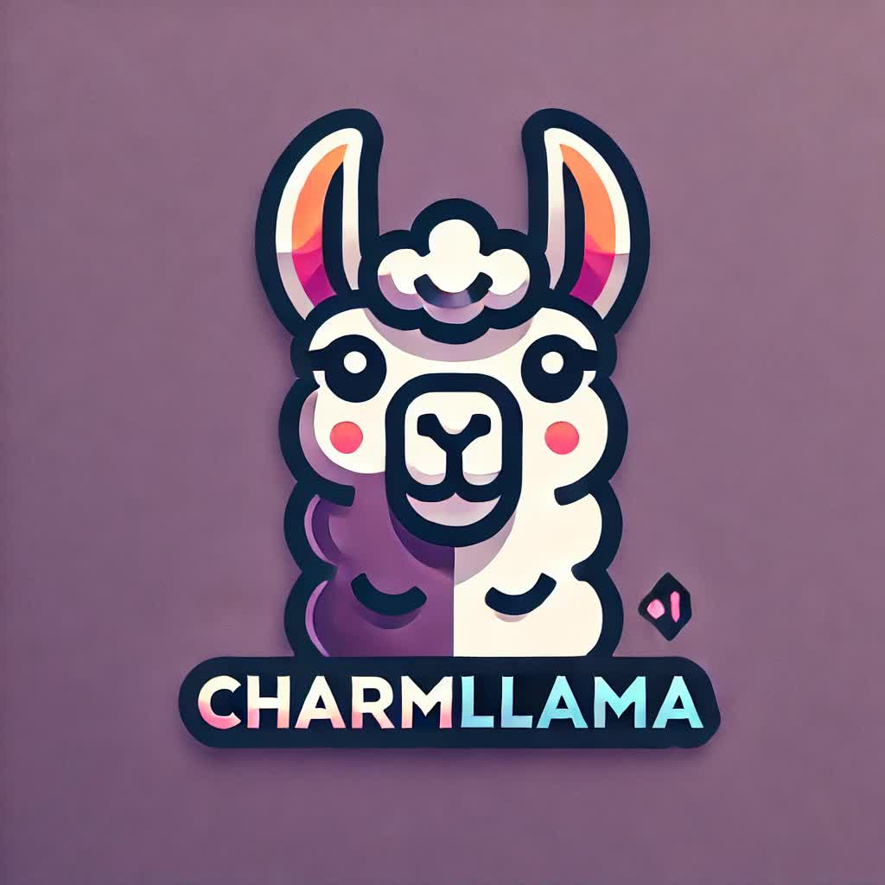
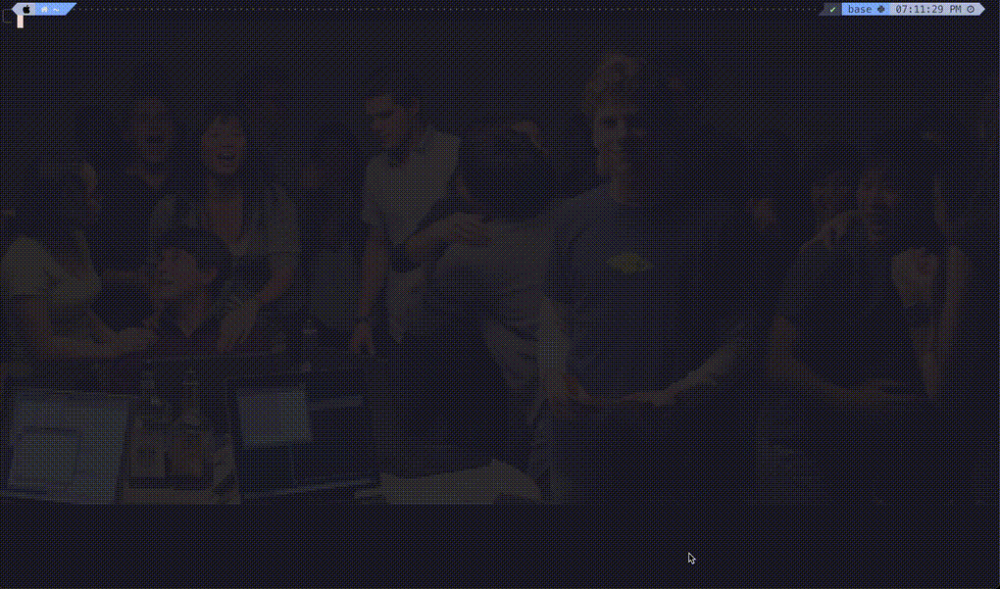

# CharmLlama

CharmLlama is a delightful CLI-based chat application that allows you to interact with Ollama's open-source language models locally. Built with Go and Charm libraries, it offers a rich terminal experience for AI-powered conversations.

<p align="center">
  
</p>

<p align="center">
  
</p>

## Features

- 🚀 Easy installation and setup
- 🤖 Automatic Ollama installation and management
- 🎨 Interactive model selection
- ✨ Stunning CLI interface with animations
- 💬 Real-time chat with Ollama models
- 📜 Markdown rendering for AI responses
- 🔄 Scrollable chat history

## Prerequisites

- Go 1.17 or later
- Ollama (CharmLlama will guide you through the installation if not present)

## Installation

### Option 1: Go Install

If you have Go installed, you can install CharmLlama using:

```bash
go install github.com/marpit19/charmlama@latest
```

If the binary exists, add the Go bin directory to your PATH:
For Zsh, add this line to your ~/.zshrc file:

```bash
export PATH=$PATH:$(go env GOPATH)/bin
```

Then reload your shell configuration:

```bash
source ~/.zshrc
```

### Option 2: Download Binary

1. Visit the [Releases](https://github.com/marpit19/charmlama/releases) page.
2. Download the appropriate binary for your operating system:
   - Windows: `charmlama-vX.X.X-windows-amd64.exe`
   - macOS: `charmlama-vX.X.X-darwin-amd64`
   - Linux: `charmlama-vX.X.X-linux-amd64`
3. Rename the binary to `charmlama` (or `charmlama.exe` on Windows).
4. Move the binary to a directory in your PATH.
5. On macOS and Linux, make the binary executable:
   ```bash
   chmod +x charmlama
   ```

### Option 3: Build from Source

1. Clone the repository:
   ```bash
   git clone https://github.com/marpit19/charmlama.git
   cd charmlama
   ```
2. Build the project:
   ```bash
   go build -o charmlama
   ```
3. Move the binary to a directory in your PATH.

## Usage

1. Open a terminal and run:
   ```bash
   charmlama
   ```
2. If Ollama is not installed, CharmLlama will guide you through the installation process.
3. Select a model from the available options.
4. Start chatting with the AI!

### Commands

- `/exit`: Exit the application

For more information on available commands, use:
```bash
charmlama --help
```

## Contributing

We welcome contributions to CharmLlama! Please see our [Contributing Guide](CONTRIBUTING.md) for more details on how to get started.

## License

CharmLlama is released under the MIT License. See the [LICENSE](LICENSE) file for details.

## Acknowledgements

- [Charm](https://charm.sh/) for their amazing terminal libraries
- [Ollama](https://ollama.ai/) for making local AI models accessible

## Support

If you encounter any issues or have questions, please [open an issue](https://github.com/marpit19/charmlama/issues/new) on our GitHub repository.

---

<p align="center">
  Built with ❤️ by Arpit Mohapatra
</p>